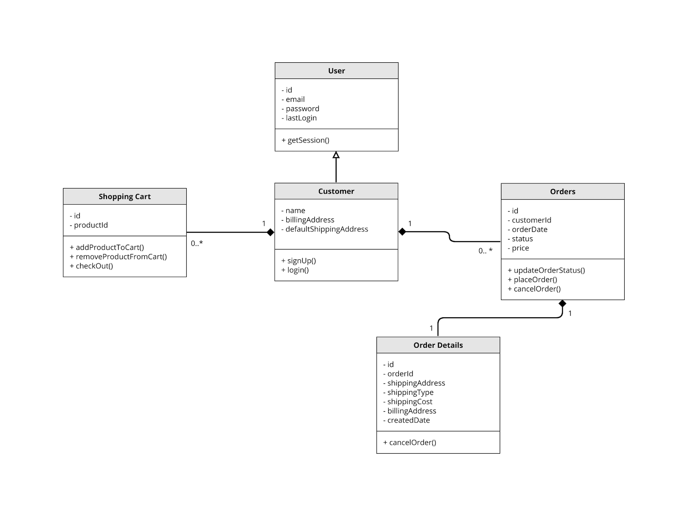
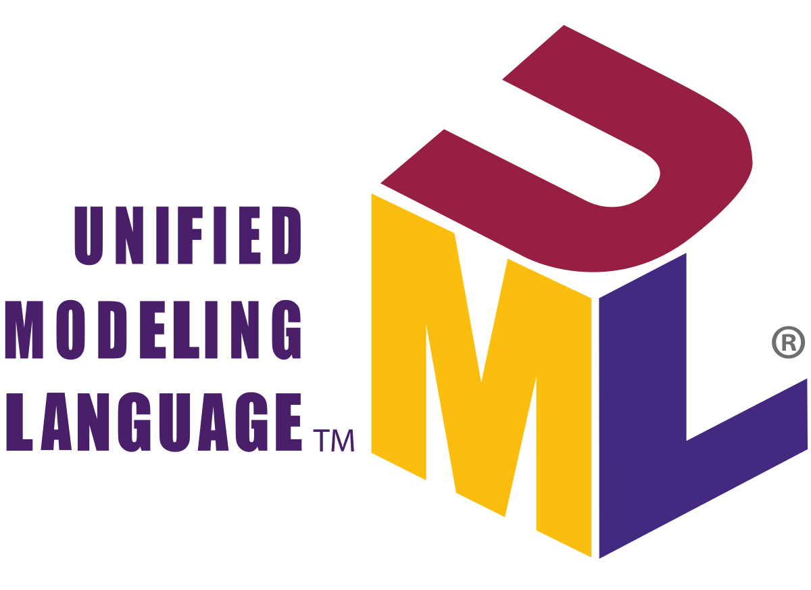
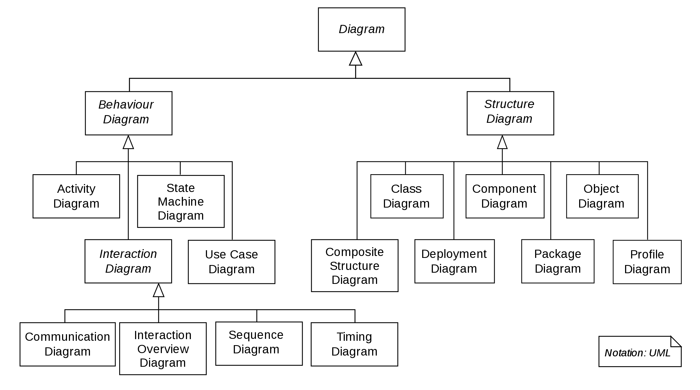
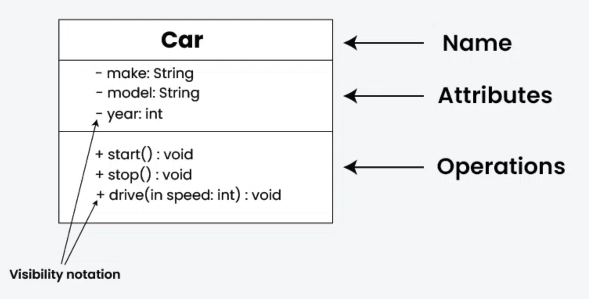
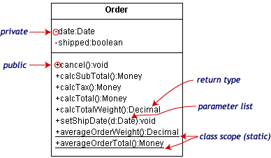

# Low-Level-System-Design

Low-level design (LLD) is a component-level design process that follows a step-by-step refinement process. This process can be used for designing data structures, required software architecture, source code and ultimately, performance algorithms. Overall, the data organization may be defined during requirement analysis and then refined during data design work. Post-build, each component is specified in detail.

The LLD phase is the stage where the actual software components are designed.

During the detailed phase the logical and functional design is done and the design of application structure is developed during the high-level design phase. 

# Why LLD ?

The goal of LLD or a low-level design document (LLDD) is to give the internal logical design of the actual program code. Low-level design is created based on the high-level design. LLD describes the class diagrams with the methods and relations between classes and program specs. It describes the modules so that the programmer can directly code the program from the document.

A good low-level design document makes the program easy to develop when proper analysis is utilized to create a low-level design document. The code can then be developed directly from the low-level design document with minimal debugging and testing. Other advantages include lower cost and easier maintenance.

# Process of Designing Low Level Systems

1. Identifying the objects in a system;

2. Defining relationships between objects;

3. Establishing the interface of each object;

4. Making a design, which can be converted to executables using OO languages;

We need a standard method/tool to document all this information; for this purpose we use `UML`. 
UML can be considered as the successor of object-oriented (OO) analysis and design. UML is powerful enough to represent all the concepts that exist in object-oriented analysis and design. UML diagrams are a representation of object-oriented concepts only. Thus, before learning UML, it is essential to understand OO concepts.

# About UML

The unified modeling language (UML) is a general-purpose visual modeling language that is intended to provide a standard way to visualize the design of a system.

# Why UML ?

It helps software developers visualize, construct, and document new software systems and blueprints. UML is used to create static structure diagrams based on a variety of engineering practices that have proven to be successful in the creation of complex systems.

- Modeling business and similar processes.
- Analysis, design, and implementation of software-based systems.
- Document the decisions that you have made.
- Provides template that guides you in constructing a system.
- Helps you visualize a system.
- Permits you to specify the structure or behavior of a system.

# Types of UML Diagrams

UML provides a standard notation for many types of diagrams which can be roughly divided into three main groups: `behavior diagrams`, `interaction diagrams`, and `structure diagrams`. 

- `Structural diagrams` :::  Structure diagrams represent the `static aspects of the system`. It emphasizes the things that must be present in the system being modeled. Since structure diagrams represent the structure, they are used extensively in documenting the software architecture of software systems. For example, the component diagram describes how a software system is split up into components and shows the dependencies among these components. 

for examples : `Class diagram` , `Component diagram` .

- `Behavioral diagrams` ::: Behavior diagrams represent the `dynamic aspect of the system`. It emphasizes what must happen in the system being modeled. Since behavior diagrams illustrate the behavior of a system, they are used extensively to describe the functionality of software systems. As an example, the activity diagram describes the business and operational step-by-step activities of the components in a system. 

for examples : `Activity diagram` , `Use case diagram` .

- `Interaction diagrams` ::: Interaction diagrams, a subset of behavior diagrams, emphasize the flow of control and data among the things in the system being modeled. For example, the sequence diagram shows how objects communicate with each other regarding a sequence of messages. 

for examples : `Sequence diagram` , `Communication diagram` .

we will discusss just Class Diagram & Use case diagram.

# Class Diagram

Class diagram in the Unified Modeling Language (UML) is a `type of static structure diagram` that describes the structure of a system by showing the system's classes, their attributes, operations (or methods), and the relationships among objects. 

The class diagram is the main building block of object-oriented modeling. It is used for general conceptual modeling of the structure of the application, and for detailed modeling, translating the models into programming code. Class diagrams can also be used for data modeling. The classes in a class diagram represent both the main elements, interactions in the application, and the classes to be programmed. 

In the diagram, classes are represented with boxes that contain `three compartments`: 

- The top compartment contains the `name` of the class. It is printed in bold and centered, and the `first letter is capitalized`.

- The middle compartment contains the `attributes` or `Variables` of the class. They are left-aligned and the `first letter is lowercase`.

- The bottom compartment contains the `operations` or `functions` the class can execute. They are also left-aligned and the `first letter is lowercase`.

`Note ::: ` colon (:) used to represents return type of functions/variables.

## Visibility

To specify the visibility of a class member (i.e. any attribute or method), these notations must be placed before the member's name.

 

- (+) Public
- (-) Private
- (#) Protected
- (~) Package
- (/) Derived

## Scope

The UML specifies two types of scope for members: instance and class. The class name appears an underlined concatenation of the instance name (if any), a colon (':'), and the actual class name.

- `Instance members` are scoped to a specific instance.
     - Attribute values may vary between instances
     - Method invocation may affect the instance's state (i.e. change instance's attributes)

- `Class members` are commonly recognized as "static" in many programming languages. The scope end is the class itself. 
     - Attribute values are equal for all instances
     - Method invocation does not affect the classifier's state.

To indicate a classifier scope for a member, its name must be underlined. Otherwise, instance scope is assumed by default. 

# Relationships

A relationship is a general term covering the specific types of logical connections found on class and object diagrams. UML defines the following relationships.

