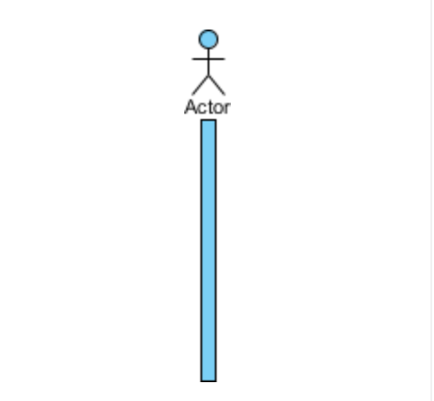

# Low-Level-System-Design

Low-level design (LLD) is a component-level design process that follows a step-by-step refinement process. This process can be used for designing data structures, required software architecture, source code and ultimately, performance algorithms. Overall, the data organization may be defined during requirement analysis and then refined during data design work. Post-build, each component is specified in detail.

The LLD phase is the stage where the actual software components are designed.

During the detailed phase the logical and functional design is done and the design of application structure is developed during the high-level design phase. 


`<<entity>>,<<boundary>>` etc... are UML Stereotype.


# Why LLD ?

The goal of LLD or a low-level design document (LLDD) is to give the internal logical design of the actual program code. Low-level design is created based on the high-level design. LLD describes the class diagrams with the methods and relations between classes and program specs. It describes the modules so that the programmer can directly code the program from the document.

A good low-level design document makes the program easy to develop when proper analysis is utilized to create a low-level design document. The code can then be developed directly from the low-level design document with minimal debugging and testing. Other advantages include lower cost and easier maintenance.


# Process of Designing Low Level Systems

1. Identifying the objects in a system;

2. Defining relationships between objects;

3. Establishing the interface of each object;

4. Making a design, which can be converted to executables using OO languages;

We need a standard method/tool to document all this information; for this purpose we use `UML`. 
UML can be considered as the successor of object-oriented (OO) analysis and design. UML is powerful enough to represent all the concepts that exist in object-oriented analysis and design. UML diagrams are a representation of object-oriented concepts only. Thus, before learning UML, it is essential to understand OO concepts.


# About UML

The unified modeling language (UML) is a general-purpose visual modeling language that is intended to provide a standard way to visualize the design of a system.


# Why UML ?

It helps software developers visualize, construct, and document new software systems and blueprints. UML is used to create static structure diagrams based on a variety of engineering practices that have proven to be successful in the creation of complex systems.

- Modeling business and similar processes.
- Analysis, design, and implementation of software-based systems.
- Document the decisions that you have made.
- Provides template that guides you in constructing a system.
- Helps you visualize a system.
- Permits you to specify the structure or behavior of a system.


# Types of UML Diagrams

UML provides a standard notation for many types of diagrams which can be roughly divided into three main groups: `behavior diagrams`, `interaction diagrams`, and `structure diagrams`. 


- `Structural diagrams` :::  Structure diagrams represent the `static aspects of the system`. It emphasizes the things that must be present in the system being modeled. Since structure diagrams represent the structure, they are used extensively in documenting the software architecture of software systems. For example, the component diagram describes how a software system is split up into components and shows the dependencies among these components. 

for examples : `Class diagram` , `Component diagram` .


- `Behavioral diagrams` ::: Behavior diagrams represent the `dynamic aspect of the system`. It emphasizes what must happen in the system being modeled. Since behavior diagrams illustrate the behavior of a system, they are used extensively to describe the functionality of software systems. As an example, the activity diagram describes the business and operational step-by-step activities of the components in a system. 

for examples : `Activity diagram` , `Use case diagram` .


- `Interaction diagrams` ::: Interaction diagrams, a subset of behavior diagrams, emphasize the flow of control and data among the things in the system being modeled. For example, the sequence diagram shows how objects communicate with each other regarding a sequence of messages. 

for examples : `Sequence diagram` , `Communication diagram` .


we will discusss Class Diagram , Use case diagram & Sequence diagram only.


# Class Diagram

Class diagram in the Unified Modeling Language (UML) is a `type of static structure diagram` that describes the structure of a system by showing the system's classes, their attributes, operations (or methods), and the relationships among objects. 

The class diagram is the main building block of object-oriented modeling. It is used for general conceptual modeling of the structure of the application, and for detailed modeling, translating the models into programming code. Class diagrams can also be used for data modeling. The classes in a class diagram represent both the main elements, interactions in the application, and the classes to be programmed. 


In the diagram, classes are represented with boxes that contain `three compartments`: 

- The top compartment contains the `name` of the class. It is printed in bold and centered, and the `first letter is capitalized`.

- The middle compartment contains the `attributes` or `Variables` of the class. They are left-aligned and the `first letter is lowercase`.

- The bottom compartment contains the `operations` or `functions` the class can execute. They are also left-aligned and the `first letter is lowercase`.

`Note ::: ` colon (:) used to represents return type of functions/variables.


## Visibility

To specify the visibility of a class member (i.e. any attribute or method), these notations must be placed before the member's name.

 

- (+) Public
- (-) Private
- (#) Protected
- (~) Package
- (/) Derived

## Scope

The UML specifies two types of scope for members: instance and class. The class name appears an underlined concatenation of the instance name (if any), a colon (':'), and the actual class name.

- `Instance members` are scoped to a specific instance.
     - Attribute values may vary between instances
     - Method invocation may affect the instance's state (i.e. change instance's attributes)

- `Class members` are commonly recognized as "static" in many programming languages. The scope end is the class itself. 
     - Attribute values are equal for all instances
     - Method invocation does not affect the classifier's state.


To indicate a classifier scope for a member, its name must be underlined. Otherwise, instance scope is assumed by default. 


# Relationships

A relationship is a general term covering the specific types of logical connections found on class and object diagrams. UML defines the following relationships.


we will discuss each & every relations.


## Generalization/Inheritance

It indicates that one of the two related classes (the subclass) is considered to be a specialized form of the other (the super type) and the superclass is considered a Generalization of the subclass. In practice, this means that any instance of the subtype is also an instance of the superclass. An exemplary tree of generalizations of this form is found in biological classification: humans are a subclass of simian, which is a subclass of mammal, and so on. The relationship is most easily understood by the phrase 'an A is a B' (a human is a mammal, a mammal is an animal).


```symbolic of realization           (subclass) ________▻ (superclass)```

A solid line with a hollow arrowhead that point from the child to the parent class.


The generalization relationship is also known as the inheritance or ```"is a"``` relationship. 

Generalization is the `name of the relationship`. Inheritance is the `mechanism` that the generalization relationship represents.


## Association

Association defines a relationship between classes of objects that allows one object instance to cause another to perform an action on its behalf. This relationship is structural, because it specifies that objects of one kind are connected to objects of another and does not represent behaviour.

Dictionary meaning :  `the act of connecting thing with another thing.`


Association relationship is a structural relationship in which different objects are linked within the system. It exhibits a binary relationship between the objects representing an activity. It depicts the relationship between objects, such as a teacher, can be associated with multiple teachers.

It is represented by a `line` between the classes followed by an arrow that navigates the direction, and when the arrow is on both sides, it is then called a bidirectional association. `We can specify the multiplicity of an association by adding the adornments on the line that will denote the association.`


An association represents a family of structural links. 
A `binary association` is represented as a solid line between two classes. 
A `reflexive association` is a binary association between the class and itself. 
An association between more than two classes is represented as a diamond connected with a solid line to each of the associated classes. 
An association between three classes is a `ternary association`. 
An association between more classes is called an `n-ary association`. 


An association can be named, and the ends of an association can be adorned with role names, aggregation indicators, multiplicity, visibility, navigability and other properties. 
The dot notation for example allows to represent with a little dot on the side of one class that the association end is owned by the other side.


There are three types of association: 

`simple association`, `shared aggregation`, `composite aggregation (composition)`. 

An association can be navigable in one or more directions. 

The navigability does not have to be explicitly specified. 

An open-headed arrow on the side of a class documents that the class can be reached efficiently at run-time from the opposite side. 

A unidirectional navigation is shown with a little cross on the association line on the side of the class that cannot be reached. 
For instance, a flight class is associated with a plane class bi-directionally. 


There are 3 types of following represtenations of associations.

`A solid line connecting two classes`. But they are further classified.


`Top:` A bidirectional association.

`Middle:` An association is bidirectional, although it may be limited to just one direction by adorning some end with an arrowhead pointing to the direction of traversal.

`Bottom:` Association is prohibited.

The objects that are related via the association are considered to act in a role with respect to the association, if object's current state in the active situation allows the other associated objects to use the object in the manner specified by the role. A role can be used to distinguish two objects of the same class when describing its use in the context of the association. A role describes the public aspects of an object with respect to an association.

The ends of the association can have all the characteristics of a property:

  -  They can have a multiplicity, expressed by a lower and an upper limit in the form of "lowerLimit..upperLimit".
  - You can have a name.
  -  You can declare a visibility.
  - You can specify whether the end of the association is ordered and / or unique.


## Aggregation

Dictionary meaning : `the collection of related items of content so that they can be displayed or linked to`
OR 
`a cluster of things that have come or been brought together.`


Aggregation is a variant of the `"has a"` association relationship; aggregation is more specific than association. It is an association that represents a `part-whole` or `part-of relationship`. As shown in the image, a Professor 'has a' class to teach. As a type of association, an aggregation can be named and have the same adornments that an association can. However, an aggregation may not involve more than two classes; it must be a binary association. Furthermore, there is hardly a difference between aggregations and associations during implementation, and the diagram may skip aggregation relations altogether.


Class diagram showing Aggregation between two classes. Here, a Professor 'has a' class to teach.


Aggregation can occur when a class is a collection or container of other classes, `but the contained classes do not have a strong lifecycle dependency on the container. The contents of the container still exist when the container is destroyed. `


In UML, it is graphically represented as a `hollow diamond` shape on the containing class with a single line that connects it to the contained class. The aggregate is semantically an extended object that is treated as a unit in many operations, although physically it is made of several lesser objects. 

Aggregation is a `subset of association`, is a collection of different things. It represents has a relationship. `It is more specific than an association`. It describes a part-whole or part-of relationship. It is a binary association, i.e., it only involves two classes. `It is a kind of relationship in which the child is independent of its parent`.


Another Example:

Here we are considering a car and a wheel example. A car cannot move without a wheel. But the wheel can be independently used with the bike, scooter, cycle, or any other vehicle. The wheel object can exist without the car object, which proves to be an aggregation relationship.


So, In aggregation, the object may only contain a reference or pointer to the object (and `not have lifetime responsibility` for it).
Therefore, Inheritance should be used only if the relationship is-a is maintained throughout the lifetime of the objects involved; otherwise, aggregation is the best choice.


## Composition

Dictionary Meaning : `the parts that form something; the way in which the parts of something are arranged`


The composite aggregation (colloquially called composition) relationship is a stronger form of aggregation where the `aggregate controls the lifecycle of the elements it aggregates`. 

The graphical representation is a `filled diamond shape` on the containing class end of the line that connect contained class(es) to the containing class. 


The composition is a part of aggregation, and it portrays [to show something] the whole-part relationship. It depicts dependency between a composite (parent) and its parts (children), which means that if the composite is discarded, so will its parts get deleted. It exists between similar objects.


As you can see from the example given below, the composition association relationship connects the Person class with Brain class, Heart class, and Legs class. If the person is destroyed, the brain, heart, and legs will also get discarded.


### Differences between Composition and Aggregation

The composition and aggregation are two subsets of association. In both of the cases, the object of one class is owned by the object of another class; the only difference is that in composition, the child does not exist independently of its parent, whereas in aggregation, the child is not dependent on its parent i.e., standalone. An aggregation is a special form of association, and composition is the special form of aggregation.


::: `Composition relationship` ::: 

- When attempting to represent real-world whole-part relationships, e.g. an engine is a part of a car.
- When the container is destroyed, the contents are also destroyed, e.g. a university and its departments.


::: `Aggregation relationship` :::

- When representing a software or database relationship, e.g. car model engine ENG01 is part of a car model CM01, as the engine, ENG01, maybe also part of a different car model.
- When the container is destroyed, the contents are usually not destroyed, e.g. a professor has students; when the professor leaves the university the students do not leave along with the professor.

Thus the aggregation relationship is often "catalog" containment to distinguish it from composition's "physical" containment. UML 2 does not specify any semantic for the aggregation compared to the simple association. 


Two class diagrams. The diagram on top shows Composition between two classes: A Car has exactly one Carburetor, and a Carburetor is a part of one Car. Carburetors cannot exist as separate parts, detached from a specific car. 

The diagram on bottom shows Aggregation between two classes: A Pond has zero or more Ducks, and a Duck has at most one Pond (at a time). Duck can exist separately from a Pond, e.g. it can live near a lake. When we destroy a Pond we usually do not kill all the Ducks.


## Realization/Implementation

A realization relationship is a relationship between two model elements, in which one model element (the client) realizes (implements or executes) the behavior that the other model element (the supplier) specifies.
 
Several clients can realize the behavior of a single supplier. 

Typically, realization relationships do not have names. If you name a realization, the name is displayed beside to the realization connector in the diagram.

As the following figure illustrates, a realization is displayed in the diagram editor as a `dashed line with an unfilled arrowhead [hollow triangle]` that points from the client (realizes the behavior) to the supplier (specifies the behavior).


`symbolic of realization           (implementer) -------▻ (interface)`


The realization relationship does not have names. It is mostly found in the interfaces.


A plain arrow head is used on the interface end of the dashed line that connects it to its users. In component diagrams, the ball-and-socket graphic convention is used (implementors expose a ball or lollipop, whereas users show a socket). 

Realizations can only be shown on class or component diagrams. A realization is a relationship between classes, interfaces, components and packages that connects a client element with a supplier element. A realization relationship between classes/components and interfaces shows that the class/component realizes the operations offered by the interface. 


`Realization is one of the phase of an implementation .`

OR 

`Implimentation is a whole process. Realization process is a part/step of whole implimentation process.`


::: Realization can be used ::: 

- A component is realized by a set of classifiers that provide its implementation.
- A collaboration instance contains the objects and messages that are needed to implement the behaviors that a use case specifies.
- To model stepwise refinement, optimizations, transformations, templates, model synthesis, framework composition, etc.


//will discuss more about realization further...


## Dependency

Dependency is "a Relationship that signifies that a single model Element or a set of model Elements requires other model Elements for their specification or implementation.

A dependency is a type of association where there is a semantic connection between dependent and independent model elements.

It exists between two elements if changes to the definition of one element (the server or target) may cause changes to the other (the client or source). This association is uni-directional. A dependency is displayed as a dashed line with an open arrow that points from the client to the supplier. 

This means that the complete semantics of the client Element(s) are either semantically or structurally dependent on the definition of the supplier Element(s).

Two or more elements in this relationship are called `tuples`.


In UML, this is indicated by a dashed line pointing from the dependent (or client) to the independent (or supplier) element. 

The arrow representing a Dependency specifies the direction of a relationship, not the direction of a process. 


Dependency depicts how various things within a system are dependent on each other. In UML, a dependency relationship is the kind of relationship in which a client (one element) is dependent on the supplier (another element). It is used in class diagrams, component diagrams, deployment diagrams, and use-case diagrams, which indicates that a change to the supplier necessitates a change to the client.


Dependency can be a weaker form of bond that indicates that one class depends on another because it uses it at some point in time. One class depends on another if the independent class is a parameter variable or local variable of a method of the dependent class. Sometimes the relationship between two classes is very weak. They are not implemented with member variables at all. Rather they might be implemented as member function arguments. 


Class diagram showing dependency between "Car" class and "Wheel" class (An even clearer example would be "Car depends on Fuel", because Car already aggregates (and not just uses) Wheel).


### Types of Dependency Relationship 

- `<<derive>> ` It is a constraint that specifies the template can be initialized by the source at the target location utilizing given parameters.

- `<<derive>>` It represents that the source object's location can be evaluated from the target object.

- `<<friend>>` It states the uniqueness of the source in the target object.

- `<<instanceOf>>` It states that an instance of a target classifier is the source object.

- `<<instantiate>>` It defines the capability of the source object, creating instances of a target object.

- `<<refine>>` It states that the source object comprises of exceptional abstraction than that of the target object.

- `<<use>>` When the packages are created in UML, the use of stereotype is used as it describes that the elements of the source package can also exist in the target package. It specifies that the source package uses some of the elements of the target package.

- `<<substitute>>` -The substitute stereotype state that the client can be substituted at the runtime for the supplier.

- `<<access>>` -It is also called as private merging in which the source package accesses the element of the target package.

- `<<import>>` -It specifies that target imports the source package's element as they are defined within the target. It is also known as public merging.

- `<<permit>>` -It describes that the source element can access the supplier element or whatever visibility is provided by the supplier.

- `<<extend>>` -It states that the behavior of the source element can be extended by the target.

- `<<include>>` -It describes the source element, which can include the behavior of another element at a specific location, just like a function call in C/C++.

- `<<become>>` -It states that target is similar to the source with distinct roles and values.

- `<<call>>` -It specifies that the target object can be invoked by the source.

- `<<copy>>` -It states that the target is an independent replica of a source object.

- `<<parameter>>` -It describes that the supplier is a parameter of the client's actions.

- `<<send>>` -The client act as an operation, which sends some unspecified targets to the supplier.


## Multiplicity


In UML, multiplicity describes how many instances of one class can be connected to an instance of another class through a given association. This relation is often expressed as a string showing the lower and upper bounds at the endpoints of a connection.

This association relationship indicates that (at least) one of the two related classes make reference to the other. This relationship is usually described as "A has a B" (a mother cat has kittens, kittens have a mother cat). 

 
Multiplicity is a definition of `cardinality` - i.e. number of elements - of some collection of elements by providing an inclusive interval of non-negative integers to specify the allowable number of instances of described element. Multiplicity interval has some lower bound and (possibly infinite) upper bound: 


The UML representation of an association is a line connecting the two associated classes. 
At each end of the line there is optional notation. 

For example, we can indicate, using an arrowhead that the pointy end is visible from the arrow tail. We can indicate ownership by the placement of a ball, the role the elements of that end play by supplying a name for the role, and the multiplicity of instances of that entity (the range of number of objects that participate in the association from the perspective of the other end). 


Some typical Examples of multiplicity:


//Examples on cardinality


The text `1 .. 5` placed at the connection's end defines the range of possible accounts. To interpret this diagram, we would start reading from left to right.

One customer must have between one and five bank accounts.


One bank account must belong to one up to two customers*.


One customer has one to five bank accounts and one bank account belongs to one or two customers.


# UML Stereotype

Stereotypes is extensibility mechanisms in UML which allows designers to extend the `vocabulary of UML` in order to create new model elements. By applying appropriate stereotypes in your model you can make the specification model comprehensible.


A stereotyped model type can appear in a project many times. For example, when modeling an online shopping system with use case diagram you might have multiple actors who are <<administrator>>. Same for class model, you might have multiple <<Enum>> or <<Model>> classes. When a stereotyped model type is being used so frequently that they become primitive building blocks in a model, allowing to create it directly saves time in redefining it again and again.

Stereotype also known as a `profile class` which defines how an existing metaclass may be extended as part of a profile. It enables the use of a platform or domain specific terminology or notation in place of, or in addition to, the ones used for the extended metaclass. 

A stereotype cannot be used by itself, but must always be used with one of the metaclasses it extends. Stereotype cannot be extended by another stereotype. 

A stereotype uses the same notation as a class, with the keyword `«stereotype»` shown before or above the name of the stereotype. Stereotype names should not clash with keyword names for the extended model element. 


Stereotype is a class, it may have properties. Properties of a stereotype are referred to as tag definitions. When a stereotype is applied to a model element, the values of the properties are referred to as tagged values. 


## Stereotype Relationships

A stereotype must always be used in conjunction with one of the metaclasses it extends. A metaclass may be extended by one or more stereotypes. Each stereotype may extend one or more metaclasses. 

Stereotypes can participate in binary association. The opposite class can be another stereotype, a non-stereotype class owned by a profile or a metaclass. The stereotype must own property at the association end to be able to navigate to the opposite class. If the opposite end is not a stereotype, the opposite property must be owned by the association itself. 


A stereotype may generalize or specialize only another stereotype. 


# Entity Control Boundary

Boundary-control-entity (BCE) is an `architectural pattern` used in `use-case driven object-oriented programming` that structures the classes composing high-level object-oriented source code according to their responsibilities in the use-case realization.

The Entity-Control-Boundary Pattern (ECB) is a variation of the `Model-View-Controller (MVC)` Pattern.

Entity, Control, and Boundary are class stereotypes, but UML has some special icons to represent them:


Here's the same diagram without the special icons:


The ECB pattern organises the responsibilities of classes according to their role in the use-case realization:

- `Entities` are objects representing system data: Customer, Transaction, Cart, etc. OR we can say it represents long-lived information relevant for the stakeholders (i.e. mostly derived from domain objects, usually persistent).

- `Boundaries` are objects that interface with system actors: user interfaces, gateways, proxies, etc. OR we can say it encapsulates interaction with external actors (users or external systems).

- `Controllers` are objects that mediate between boundaries and entities. They orchestrate the execution of commands coming from the boundary. OR we can say ensures the processing required for the execution of a use-case and its business logic, and coordinates, sequences controls other objects involved in the use-case.

It was originally called `Entity-Interface-Control (EIC)` but very quickly the term `"boundary" replaced "interface"` in order to avoid the potential confusion with object-oriented programming language terminology.

The corresponding classes are then grouped into service packages, which are an indivisible set of related classes that can be used as software delivery units. 

ECB classes are first identified when use-cases are analyzed ::::

- every use case is represented as a control class;
- every different relation between a use-case and an actor is represented as a boundary class;
- entities are derived from the use-case narrative.

The classes are then refined and re-structured or reorganized as needed for the design, for example:

- Factoring out common behaviors in different use-case controls
- Identifying a central boundary class for each kind of human actor and for each external system that would provide a consistent interface to the outside world.  

The ECB pattern assumes that the responsibilities of the classes is also reflected in the relations and interactions between the different categories of classes in order to ensure the robustness of the design.


## Robustness Diagram

Robustness diagrams allow to visually represent the `relation between entities, controls, boundaries and actors.` It uses graphical stereotypes introduced in Jacobson's early work:


The following robustness constraints apply: 

- `Actors` may only know and communicate with boundaries
- `Boundaries` may communicate with actors and controls only.
- `Controls` may know and communicate with boundaries and entities, and if needed other controls.
- `Entities` may only know about other entities but could communicate also with controls.

In principle entities should not know about boundaries and controls. In practice however, some variants allow entities, boundaries and controls to subscribe as observer to an entity.

Similarly, the constraint of a boundary class not knowing about other boundary classes only applies at the highest level, and not between classes that cooperate to implement the same boundary. 


# Use Case Diagrams

Use case diagrams is a `behavior diagrams` used to describe a set of `actions (use cases)` that some `system or systems (subject)` should or can perform in collaboration with one or more external users of the system (actors). Each use case should provide some observable and valuable result to the actors or other stakeholders of the system. 

A use-case model describes a `system's functional requirements in terms of use cases`. It is a model of the system's intended functionality (use cases) and its environment (actors). Use cases enable you to relate what you need from a system to how the system delivers on those needs.


`Note :::` Use cases represent only the `functional requirements` of a system. Other requirements such as business rules, quality of service requirements, and implementation constraints must be represented separately, again, with other UML diagrams.

- Use Case Diagrams describe the high-level functional behavior of the system.
- It answers what system does from the user point of view.
- Use case answers ‘What will the system do?’ and at the same time tells us ‘What will the system NOT do?'.

A use case illustrates a unit of functionality provided by the system. `The primary purpose of the use case diagram is to help development teams visualize the functional requirements of a system, including the relationship of “actors” to the essential processes, as well as the relationships among different use cases.`


## Why Use Case Diagrams ?

Use case diagrams are typically developed in the early stage of development.

A use case itself might drill into a lot of detail about every possibility, a use-case diagram can help provide a higher-level view of the system. It has been said before that "Use case diagrams are the blueprints for your system".

Due to their simplistic nature, use case diagrams can be a good communication tool for stakeholders. The drawings attempt to mimic the real world and provide a view for the stakeholder to understand how the system is going to be designed. Siau and Lee conducted research to determine if there was a valid situation for use case diagrams at all or if they were unnecessary. What was found was that the use case diagrams conveyed the intent of the system in a more simplified manner to stakeholders and that they were "interpreted more completely than class diagrams".

Developers often apply use case modeling for the following purposes :

- Specify the context of a system
- Capture the requirements of a system
- Validate a systems architecture
- Drive implementation and generate test cases
- Developed by analysts together with domain experts


## Components of the Use Case Diagrams

- `System boundary:` A system boundary defines the scope and limits of the system. It is shown as a rectangle that spans all use cases of the system.


- `Actors:` An actor is an entity who performs specific actions. These roles are the actual business roles of the users in a given system. An actor interacts with a use case of the system. For example, in a banking system, the customer is one of the actors.


- `Use Case:` Every business functionality (System functions) is a potential use case. The use case should list the discrete business functionality specified in the problem statement. 


Each Actor must be linked to a use case, while some use cases may not be linked to actors.


## Use Case Relationship


- `Include:` Include relationship represents an invocation of one use case by another use case. From a coding perspective, it is like one function being called by another function. 


The include relationship adds additional functionality not specified in the base use case. The `<<Include>>` relationship is used to include common behavior from an included use case into a base use case in order to support the reuse of common behavior.


A uses relationship from base use case to child use case indicates that an instance of the base use case will include the behavior as specified in the child use case.

An include relationship is depicted with a directed arrow having a dotted line. `The tip of arrowhead points to the child use case and the parent use case connected at the base of the arrow.`

`(base-use-case) ------> (child-use-case)`

The stereotype `"<<include>>"` identifies the relationship as an include relationship.


- `Extend:` This relationship signifies that the extended use case will work exactly like the base use case, except that some new steps will be inserted in the extended use case.


The extend relationships are important because they show optional functionality or system behavior. The` <<extend>>` relationship is used to include optional behavior from an extending use case in an extended use case. Take a look at the use case diagram example below. It shows an extend connector and an extension point "Search".


Indicates that an "Invalid Password" use case may include (subject to specified in the extension) the behavior specified by base use case "Login Account".

Depict with a directed arrow having a dotted line. `The tip of arrowhead points to the base use case and the child use case is connected at the base of the arrow.`

`(child-use-case) ------> (base-use-case)`

The stereotype `"<<extends>>"` identifies as an extend relationship


- `Association Link :` A Use Case diagram illustrates a set of use cases for a system, i.e. the actors and the relationships between the actors and use cases.


- `Generalization:` A generalization relationship is a parent-child relationship between use cases. 


The child use case is an enhancement of the parent use case.


A generalization relationship means that a child use case inherits the behavior and meaning of the parent use case. The child may add or override the behavior of the parent. The figure below provides a use case example by showing two generalization connectors that connect between the three use cases.


`(child-use-case) ------> (base-use-case)`

The child use case is connected at the base of the arrow. The tip of the arrow is connected to the parent use case.


# Sequence Diagram

A Sequence diagram shows process interactions arranged in time sequence. 

This diagram depicts the processes and objects involved and the sequence of messages exchanged as needed to carry out the functionality. 


Sequence diagrams are typically associated with use case realizations in the `4+1 architectural view model` of the system under development. Sequence diagrams are sometimes called `event diagrams` or `event scenarios`. 

For a particular scenario of a use case, the diagrams show the events that external actors generate, their order, and possible inter-system events.

The diagram emphasizes events that cross the system boundary from actors to systems. A system sequence diagram should be done for the main success scenario of the use case, and frequent or complex alternative scenarios. 


## Types of Sequence Diagrams

There are two kinds of sequence diagrams:

- `Sequence Diagram (SD)` ::: A regular version of sequence diagram describes how the system operates, and every object within a system is described specifically.

- `System Sequence Diagram (SSD)` ::: All systems are treated as a `black box`, where all classes owned by the system are not depicted. Instead, only an object named System is depicted.


## Key elements of Sequence Diagrams

A sequence diagram shows, as parallel vertical lines (`lifelines`), different processes or objects that live simultaneously, and, as horizontal arrows, the messages exchanged between them in the order in which they occur. This allows for the graphical specification of simple runtime scenarios. 


A system sequence diagram should specify and show the following:

- `lifelines` ::: An individual participant in the sequence diagram is represented by a lifeline. It is positioned at the top of the diagram. 


- `External actors` ::: A role played by an entity that interacts with the subject is called as an actor. It is out of the scope of the system. It represents the role, which involves human users and external hardware or subjects. An actor may or may not represent a physical entity, but it purely depicts the role of an entity. Several distinct roles can be played by an actor or vice versa.



- `Activation` ::: It is represented by a thin rectangle on the lifeline. It describes that time period in which an operation is performed by an element, such that the top and the bottom of the rectangle is associated with the initiation and the completion time, each respectively.


    
- Messages (methods) invoked by these actors (`Call Message`) ::: It defines a particular communication between the lifelines of an interaction, which represents that the target lifeline has invoked an operation.


    
- Return values (if any) associated with previous messages (`Return Message`) ::: It defines a particular communication between the lifelines of interaction that represent the flow of information from the receiver of the corresponding caller message.


    
-  `Self Message`  ::: It describes a communication, particularly between the lifelines of an interaction that represents a message of the same lifeline, has been invoked.


-  `Recursive Message` ::: A self message sent for recursive purpose is called a recursive message. In other words, it can be said that the recursive message is a special case of the self message as it represents the recursive calls.


-  `Create Message`  ::: It describes a communication, particularly between the lifelines of an interaction describing that the target (lifeline) has been instantiated.


-  `Destroy Message` ::: It describes a communication, particularly between the lifelines of an interaction that depicts a request to destroy the lifecycle of the target.


-  `Duration Message` ::: It describes a communication particularly between the lifelines of an interaction, which portrays the time passage of the message while modeling a system.


- `Note` ::: A note is the capability of attaching several remarks to the element. It basically carries useful information for the modelers.


### Sequence Fragments

- UML 2.0 introduces sequence (or interaction) fragments. Sequence fragments make it easier to create and maintain accurate sequence diagrams
    
- A sequence fragment is represented as a box, called a combined fragment, which encloses a portion of the interactions within a sequence diagram
    
- The fragment operator (in the top left cornet) indicates the type of fragment
    
- Fragment types: ref, assert, loop, break, alt, opt, neg


// Types of fragments

- `alt` ::: Alternative multiple fragments: only the one whose condition is true will execute.

- `opt` ::: Optional, the fragment executes only if the supplied condition is true. Equivalent to an alt only with one trace.

- `par` ::: Parallel, each fragment is run in parallel.

- `loop` ::: Loop, the fragment may execute multiple times, and the guard indicates the basis of iteration.

- `region` ::: Critical region: the fragment can have only one thread executing it at once.

- `neg` ::: Negative: the fragment shows an invalid interaction.

- `ref` ::: Reference: refers to an interaction defined on another diagram. The frame is drawn to cover the lifelines involved in the interaction. You can define parameters and a return value.

- `sd` ::: Sequence diagram: used to surround an entire sequence diagram.


## Why Sequence Diagrams?

- It explores the real-time application.
    
- It depicts the message flow between the different objects.
    
- It has easy maintenance.
    
- It is easy to generate.
    
- Implement both forward and reverse engineering.
    
- It can easily update as per the new change in the system.

 

## Why not Sequence Diagrams?

- In the case of too many lifelines, the sequence diagram can get more complex.
    
- The incorrect result may be produced, if the order of the flow of messages changes.
    
- Since each sequence needs distinct notations for its representation, it may make the diagram more complex.
    
- The type of sequence is decided by the type of message.


## How to Draw a Sequence Diagram

A sequence diagram represents the scenario or flow of events in one single use case. The message flow of the sequence diagram is based on the narrative of the particular use case.

Then, before you start drawing the sequence diagram or decide what interactions should be included in it, you need to draw the use case diagram and ready a comprehensive description of what the particular use case does.


From the above use case diagram example of ‘Create New Online Library Account’, we will focus on the use case named ‘Create New User Account’ to draw our sequence diagram example.

Before drawing the sequence diagram, it’s necessary to identify the objects or actors that would be involved in creating a new user account. These would be;

- Librarian
    
- Online Library Management system

- User credentials database
    
- Email system

Once you identify the objects, it is then important to write a detailed description of what the use case does. From this description, you can easily figure out the interactions (that should go in the sequence diagram) that would occur between the objects above, once the use case is executed.

Here are the steps that occur in the use case named ‘Create New Library User Account’.

- The librarian request the system to create a new online library account
    
- The librarian then selects the library user account type
    
- The librarian enters the user’s details
    
- The user’s details are checked using the user Credentials Database
    
- The new library user account is created
    
- A summary of the new account’s details is then emailed to the user

From each of these steps, you can easily specify what messages should be exchanged between the objects in the sequence diagram. Once it’s clear, you can go ahead and start drawing the sequence diagram.

The sequence diagram below shows how the objects in the online library management system interact with each other to perform the function ‘Create New Library User Account’.


## Common Mistakes while drawing Sequence Diagrams

When drawing sequence diagrams, designers tend to make these common mistakes. By avoiding these mistakes you can ensure the quality of your diagram.

- Adding too much detail. This clutters up the diagram and makes it difficult to read.
    
- Obsolete and out-of-date sequence diagrams that are irrelevant when compared to the interfaces, actual architectures, etc. of the system. Don’t forget to replace them or modify them.
    
- Leaving no blank space between the use case text and the message arrow; this makes it difficult for anyone to read the diagram.
    
- Not considering the origins of message arrows carefully.


## Sequence Diagram Example

It is a Online Movie Ticket Booking System Sequence Diagram.


